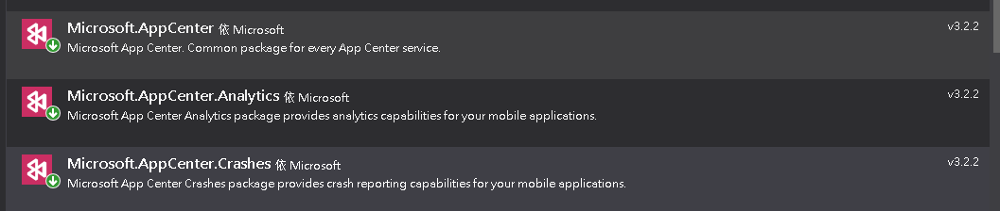
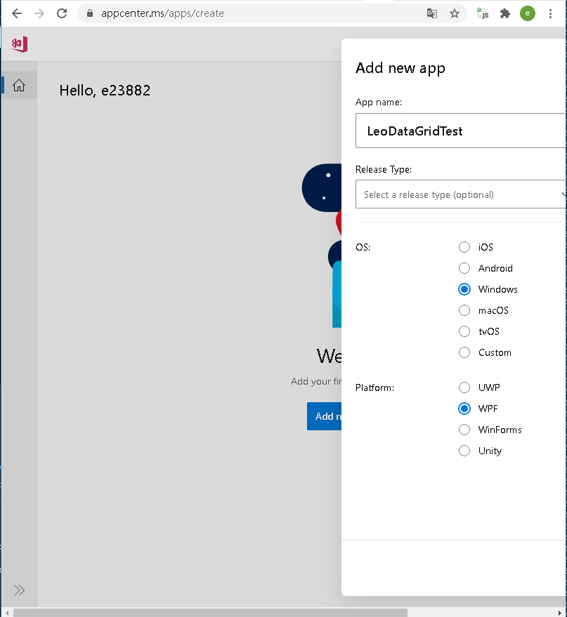
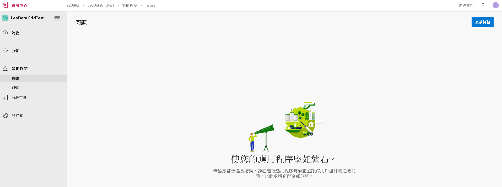
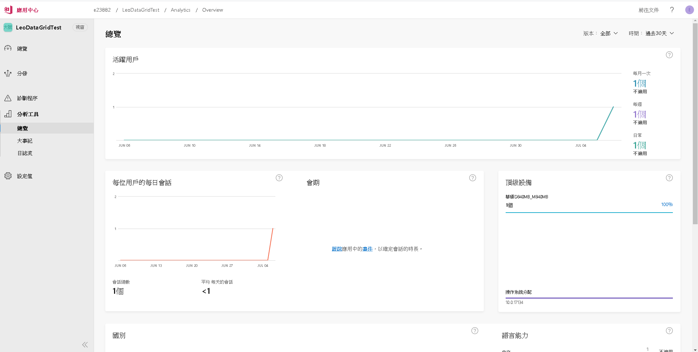

## nuget安裝套件
```
Microsoft.AppCenter
Microsoft.AppCenter.Analytics
Microsoft.AppCenter.Crashes
```


## AppCenter中建立應用程式
建立完會拿到一組Key 長得像這樣 007e393d-9250-4bfa-aaaa-cccc0000oooo

[AppCenter](https://appcenter.ms/apps/create)



## App.xaml加入AppCenter程式碼
```csharp
using System.Windows;
using Microsoft.AppCenter;
using Microsoft.AppCenter.Analytics;
using Microsoft.AppCenter.Crashes;

namespace DataGridDemo
{
    /// <summary>
    /// App.xaml 的互動邏輯
    /// </summary>
    public partial class App : Application
    {
        protected override void OnStartup(StartupEventArgs e)
        {
            base.OnStartup(e);
            AppCenter.Start("{key}", typeof(Analytics), typeof(Crashes));
        }
    }
}

```
    
## 可以幹嘛
可以知道使用者相關資訊(地區、作業系統)還有程式Crash的相關資訊

