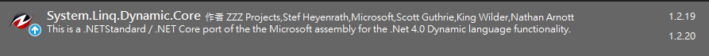

## Dynamic Linq
### 要用到的情境
我們常常用Linq去做篩選資料或是加總資料的動作
```csharp
List<className> list = new List<className>();
list.where(x=>x.FieldA == "" && x.FieldB > 123);
```
但是有些情況linq裡面的敘述不能寫死，必須要是動態的，如果在有需要的時候可能就要一次把所有欄位都寫上去，再做判斷，如果欄位很多的時候就會很痛苦....

### 安裝套件


### 如何使用
```csharp
string linqQuery = "FieldA in ('1', '2', '3') and FieldB > 10"
List<className> list = new List<className>();
var result = list.AsQueryable().Where(LinqQuery);
```
[更多DynamicLinq用法](https://dynamic-linq.net/) 
