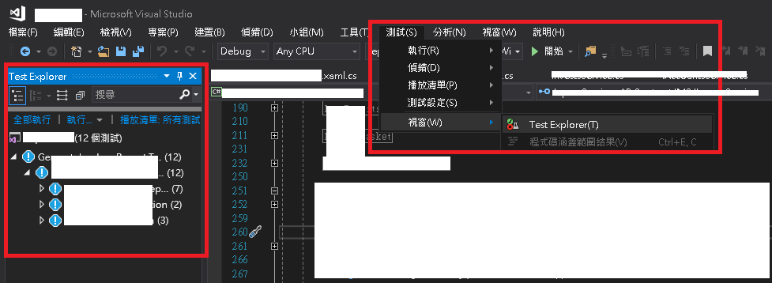
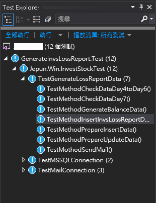
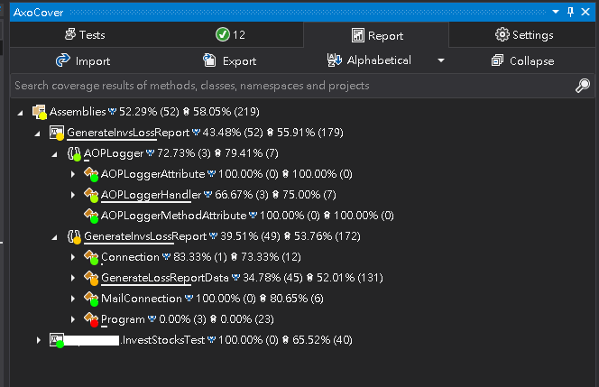
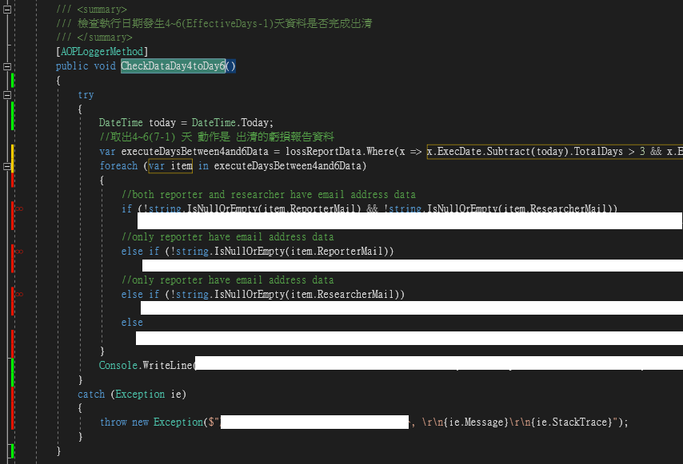
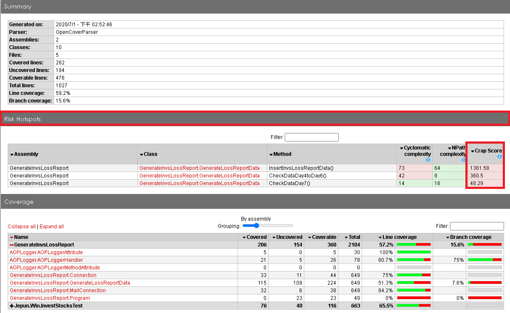

## NUnit
---
### NUnit是什麼
NUnit是一種測試框架，常見的還有MSTest、xUnit，但因為我需要免費的工具(AXOCover)去看測試涵蓋率，所以選了一個AXOCover有支援的測試框架

### Visual Studio 使用NUnit執行單元測試
安裝visual studio NUnit2 test adapter extension<br>
一定要裝，不然不能執行NUnit測試框架(Visual Studio 2017 Community)


安裝完在開發的專案裡面開一個NUnit的測試專案


### 測試怎麼寫
測試專案結構大概長這樣，有SetUp跟TestCase Attribute

```csharp
public class Tests
{
    [SetUp]
    public void Setup()
    {
    }

    [TestCase]
    public void Test1()
    {
        Assert.Pass();
    }
}
```
####  SetUp
SetUp attribute 是每個測試(TestCase)執行之前都會執行的動作，像是把要測試的物件產生實例(instance)就可以放在Setup方法裡面，要注意這邊他是依照SetUp Attribute去做初始化的動作，不是因為方法名稱才會有這樣的行為
```csharp
public class Tests
{
    [SetUp]
    public void Setup()
    {
    }
}
```

#### TestCase
TestCase 就是每個測試的案例
```csharp
public class Tests
{
    [TestCase]
    public void TestPropertyXXX()
    {
    }
}
```
#### 範例
**要先把方案(Solution)中 MSTest的專案卸載掉，不然Visual Studio會只執行MSTest專案的測試**
```csharp
public class Tests
{
  //宣告變數vm
  ViewModel vm = null;

  //初始化，產生實例
  [SetUp]
  public void Setup()
  {
      vm = new ViewModel();
  }

  //測試單元
  [Test]
  public void Test1()
  {
      //預期值
      var Expected = "Leo";
      //設定物件屬性(test object setter)
      vm.Field = Expected;
      //檢查物件屬性是不是跟預期相同
      Assert.AreEqual(vm.Field, Expected);
  }
}
```

#### 執行測試


測試結果


---
## AXOCover - 使用AXOCover看測試涵蓋率
### 安裝visual studio AXO Cover extension


如果沒裝，執行結果大概長這樣

  
如果有裝的話..

  

AXO Cover - 測試涵蓋率


在Code中了解目前測試的狀態(已測試、尚未測試、部分測試)更清楚問題可能會發生在那些地方

  
還能輸出報表，透過Risk Hotspots知道自己程式哪邊可能有問題哪邊寫得很爛(Scrap Score)，可以用這個垃圾分數當成依據，去把程式改得更好，或是從根本調整自己寫程式的習慣


### 使用TestCase Attribute
如果客戶發生問題，可以針對他的情境去測試，不用額外再開UI出來，可以在測試專案中，組出來User的操作，模擬問題


### 為啥要寫測試
常常會有那種改A壞B、改B壞C，如果改完程式有測出來問題那就算了，往往都是改了之後只針對當下的情境去測試，沒有測到其他的情況，最後發現問題的時候都是資料已經錯很久了，要花時間查、還要想辦法把有問題的資料修正，很麻煩

### 啥時要寫測試
有時間就寫，你不知道什麼時候程式會壞掉或是被誰改壞掉，如果有寫測試，每次Pull完就可以執行一下，看程式還能不能正常運作、哪個地方有問題。<br>
就算公司沒人在做，你也可以自己寫給自己用，最好是開發時估工時就把寫測試的時間算進去，code寫完過了一年三年，中間就算經手很多人，只要當初的測試依跑，就能知道到底還有多少地方可以正常執行，還可以透過測試知道他運作的流程是什麼