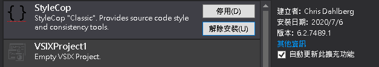
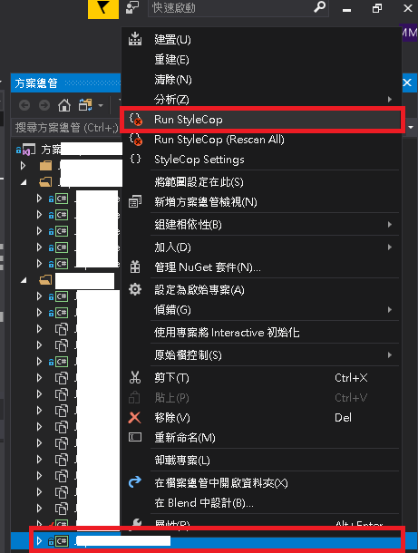
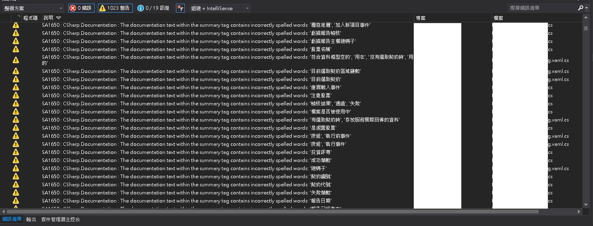
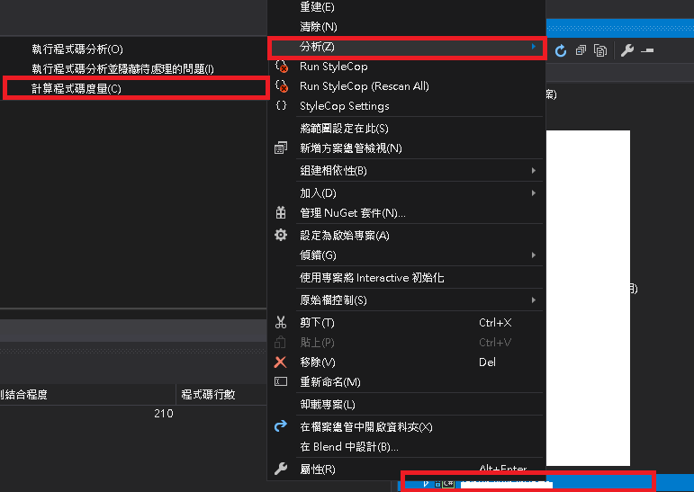
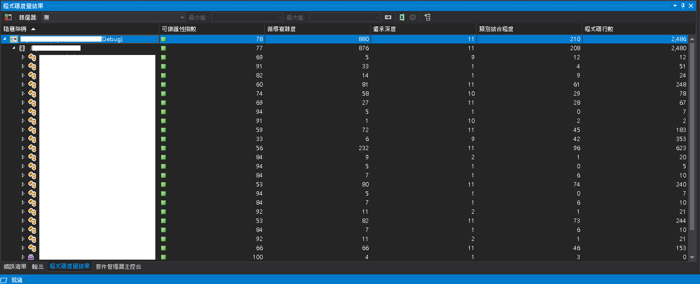

## 透過StyleCop檢查Coding StyleStyleCop
### 1. 安裝VisualStudioExtension

### 2. 檢查專案
### 2.1 CodingStyle

可以檢查那些檔案沒有符合團隊的CodingStyle，不用每次都要人工檢查

執行結果:

***
### 2.2 檢查程式碼度量
可以量化程式的可維護性、複雜度、繼承深度、類別結合程度，看程式哪邊的耦合性太強，跟AXOCover測試結果報表的垃圾分數(CrapScore)有點像，可以透過這個數值去優化程式

結果
