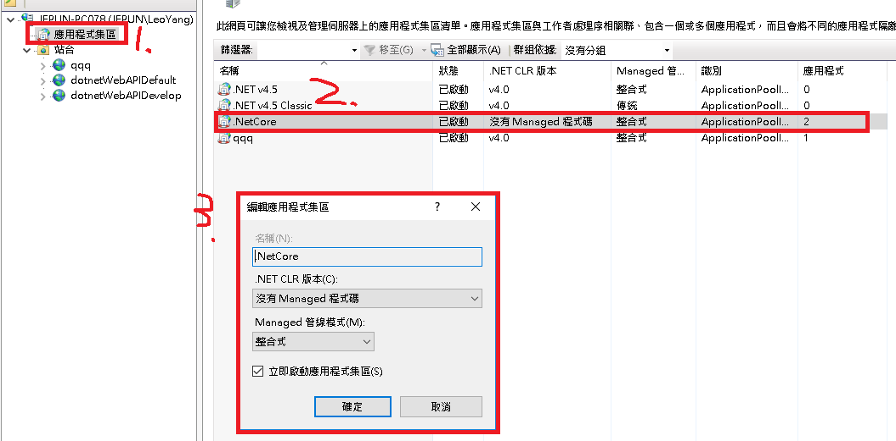
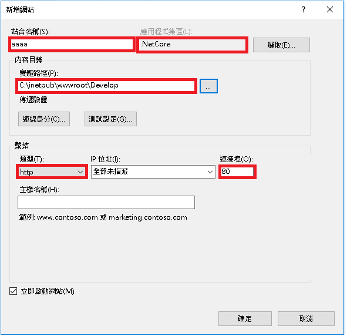
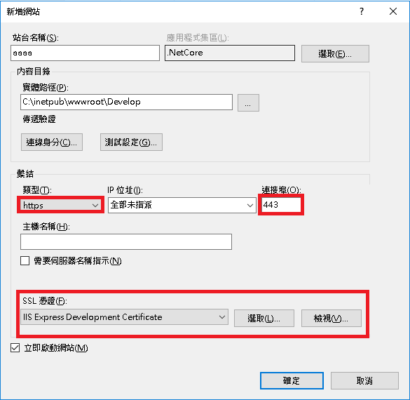
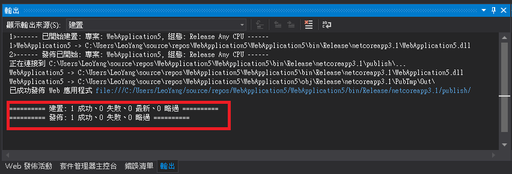
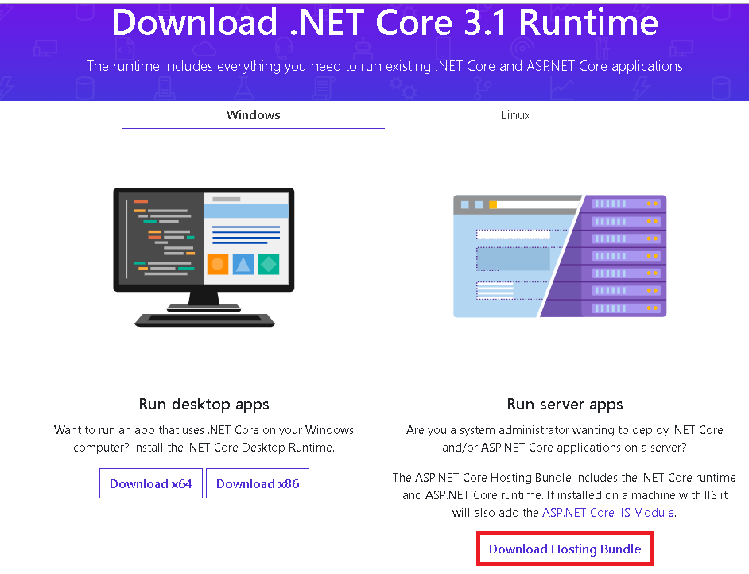
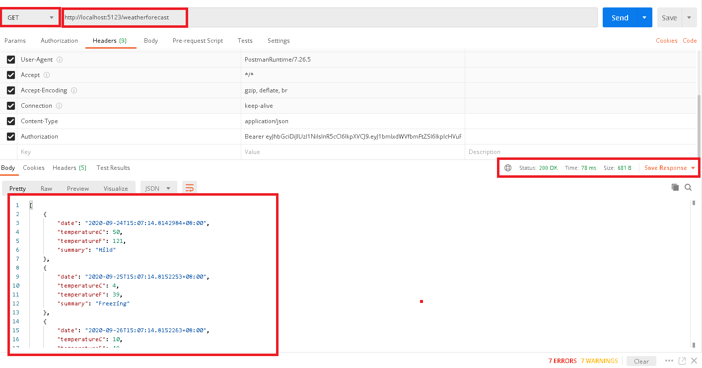
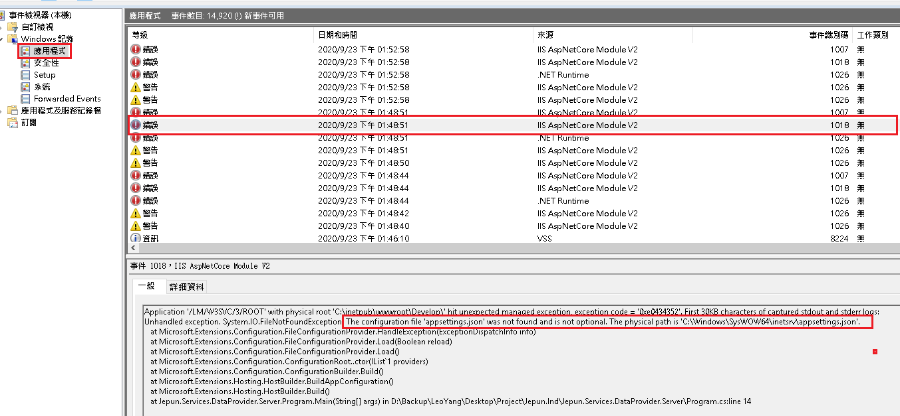

# 發布 .net core webapi 到iis


因為這樣就不會有一個黑黑色的視窗在那邊，如果不清楚這是在做什麼的人不小心關掉的話，API就停止了

可以在IIS裡統一管理目前正在執行的API有哪些，還可以透過window事件檢視器看到api的log

---
## IIS
### 建立IIS應用程式集區
建立一個叫做NetCore的應用程式集區跟.netframework的應用程式集區做區隔
.NET CLR版本要選沒有 'Managed程式碼'

### 新增IIS站台
透過http連線的站台，主要設定的有
- 站台名稱(管理用的)
- 應用程式集區
- 實體路徑
- 類型
- 連接埠
  


如果要設定https的站台，只要把類型改成https，然後選取對應的SSL憑證就可以了



---

## 發布專案
如果沒有什麼特殊的需求，基本上只要設定發布的位置就可以了，可以設定剛剛IIS站台的實體路徑，或是其他地方在複製到IIS站台實體路徑裡，然後按發布按鈕visual studio就會開始發布API


如果發布的時候不是選IIS站台設定的實體路徑，發布成功之後要把發布的檔案移到IIS站台實體路徑下


---

## 安裝 .Net Core Hosting Bundle
[host bundle 下載連結 ](發布-Net-Core-Webapi到IIS/https://dotnet.microsoft.com/download/dotnet-core/current/runtime)

依照webapi專案的 . net core版本安裝對應的hosting bundle，版本應該是有向下相容吧....吧


---
## 測試
用postman帶對應的參數打打看API，如果StatusCode是200，也是回應正確的內容就是成功了


---

## 常見問題

如果是這幾種錯誤代碼，基本上就是服務已經掛上去了，但是環境有一些問題，如果拿去google會找到一大堆不一樣的解法，照著做了之後api還是不能用，萬用解就是開windows事件檢視器(eventvwr)，看詳細的錯誤訊息是什麼一一解決，會比在網路上隨便找得更精準的解決掉你自己環境的問題
```
HTTP Error 500.30 - ANCM In-Process Start Failure
HTTP Error 500.38 - ANCM Application DLL Not Found
HTTP Error 500.31 - ANCM Failed to Find Native Dependencies
HTTP Error 502.5 - ANCM Out-Of-Process Startup Failure (Windows Server)
The specified version of Microsoft.NetCore.App or Microsoft.AspNetCore.App was not found.
```



這幾種跟config設定有很大的關係，可能就是google到的解法叫你改config，結果註解掉xml開頭的tag沒有拿掉結束的tag，如果遇到這種問題可以先把IIS站台實體路徑裡面的檔案跟專案發布的檔案都先備份起來然後刪掉環境的檔案，重新發布一次，或是像我一樣開一個全新的. net core web api，發布一次比對排除有可能發生問題的地方
```
HTTP Error 500.1X
HTTP Error 500.19 - Internal Server Error
HTTP Error 404
```