# 用Sonarqube做靜態程式碼分析
## 環境
Sonarqube需要在有java的環境下才能執行，所以要先安裝java
java18

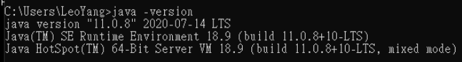

安裝Sonarqube Community

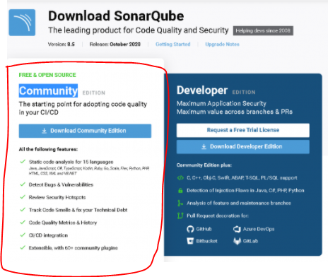

## 啟動Sonarqube
Sonarqube Community 下載完解壓縮，在.sonarqube-8.4.2.36762\bin\windows-x86-64目錄下依序用管理員權限去註冊需要的服務(1.2)，然後用管理員權限啟用Sonarqube(3)

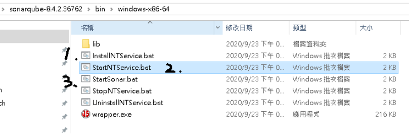

如果沒有看到例外訊息，看到這幾個關鍵字就代表服務已經啟用了，有例外的話先把作業系統中sonarqube相關的process殺掉再重啟試試看，基本上這樣就可以解決大部分的問題，如果相同的例外訊息一直出現就要上網找一下是發生什麼問題，然後加到這篇文章裡面

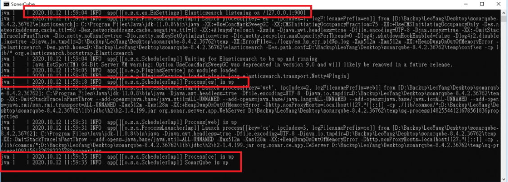


## 登入Sonarqube
在瀏覽器打localhost:9000應該就會看到設定畫面，因為我已經設定完了，所以就會顯示登入畫面

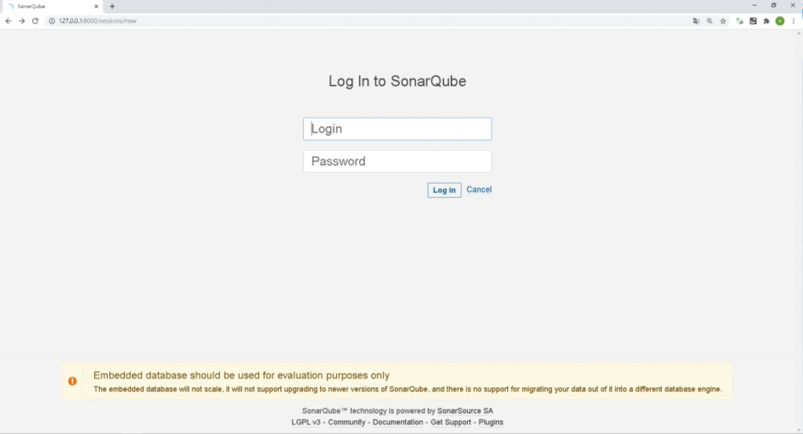

登入之後會看到目前專案程式碼分析的結果，主要會分成幾個部分

程式問題(Bug)、漏洞(Vulnerabilities)、安全問題(Hotspots Reviewed)、

程式不良設計(Code Smells)、測試涵蓋率(Coverage)、重複代碼(Duplications)

最後面那個2.9K、103K是指目前程式欠了多少技術債， 點專案名稱可以看到專案更詳細的程式碼分析
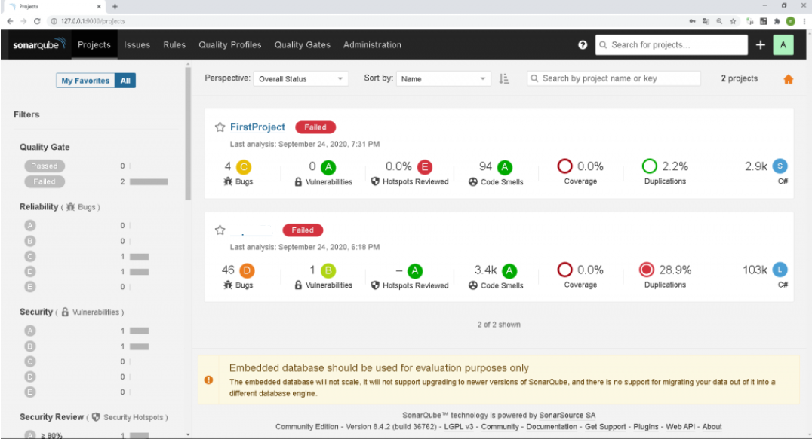
## 主要功能
### issue
issues 會記錄bug的種類、嚴重程度還有如何修正…e.t.c.
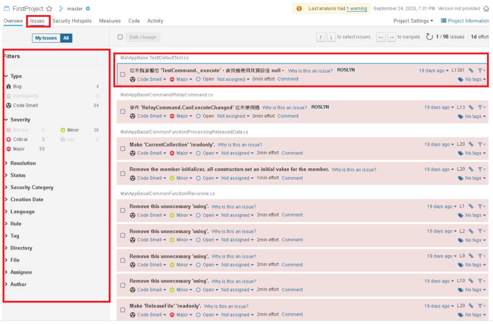
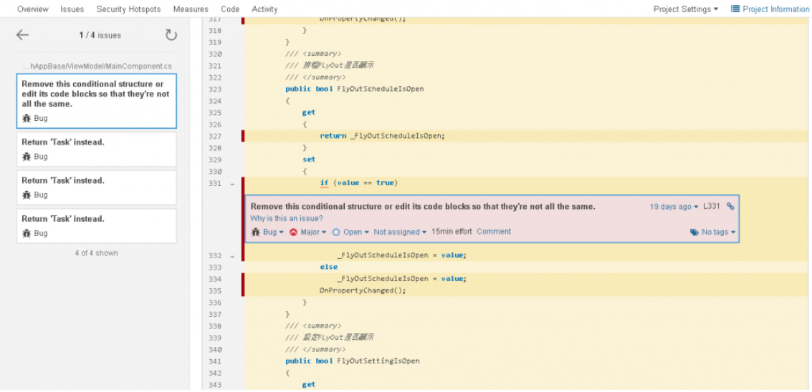

### Security Hotspots
Security Hotspots是指程式碼資安的漏洞，像我這裡程式碼用了一個正規表示法的檢查去篩選資料，就被判斷裡面可能會有邏輯上的漏洞
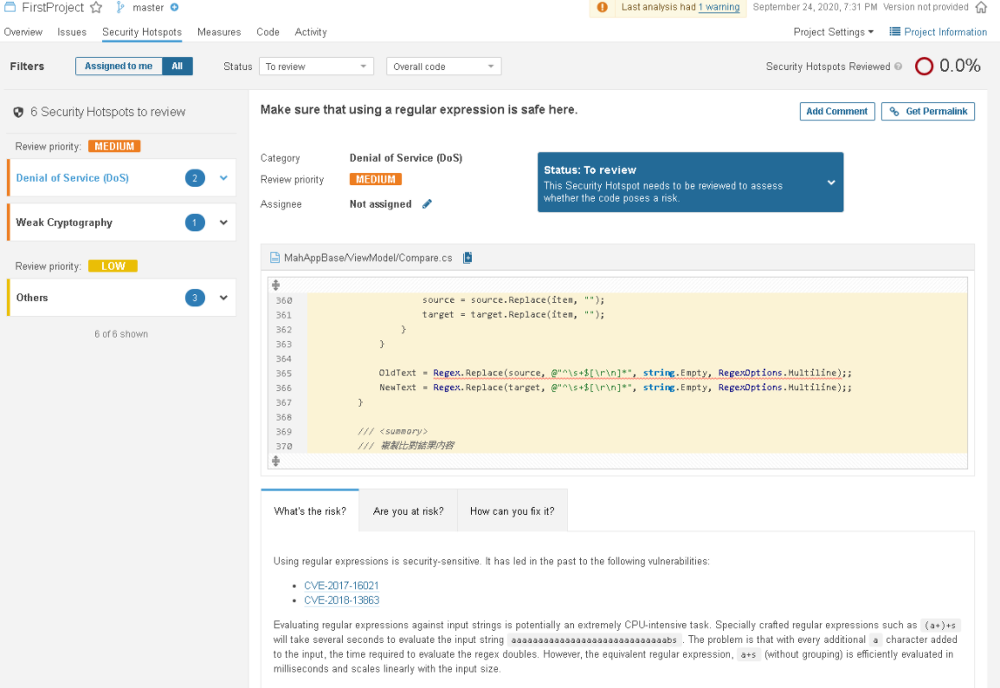

## 新增專案
在主畫面右上角按這個+可以新增專案，他會給你一組token作為分析程式碼的key，這裡還要下載一個Sonarqube的掃描器(Scanner)
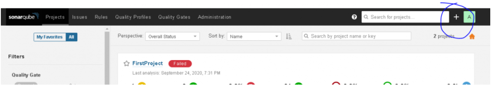
https://docs.sonarqube.org/latest/analysis/scan/sonarscanner-for-msbuild/

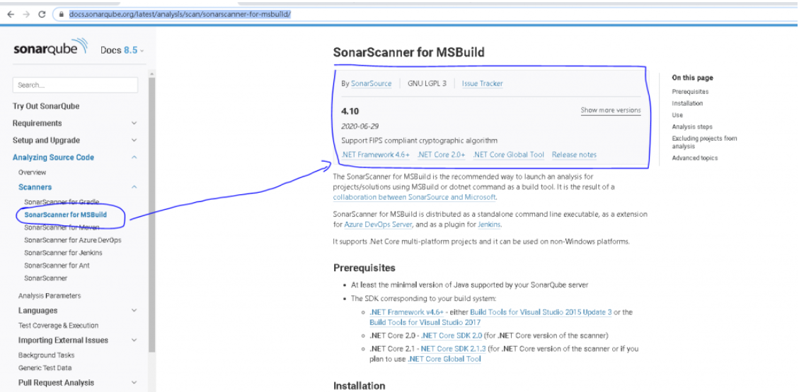

拿新增專案時的token當成參數去呼叫scanner，分析的結果就會顯示到sonarqube的主畫面上了，呼叫掃描器的代碼大概長這樣
```batch
cd /D D:\LeoYang\Desktop\Publisher
D:\LeoYang\Desktop\Scanner\MSBuild.SonarQube.Runner.exe begin /k:"FirstProject" /d:sonar.host.url="http://localhost:9000" /d:sonar.login="48a60c2565d9929037d9e168a182deb484ec44e2"
D:\vs2017\MSBuild\15.0\Bin\MSBuild.exe /t:Rebuild /consoleloggerparameters:ErrorsOnly
D:\LeoYang\Desktop\Scanner\MSBuild.SonarQube.Runner.exe end /d:sonar.login="48a60c2565d9929037d9e168a182deb484ec44e2"
```

可以寫成batch，透過githook在push之後去讓它自動分析程式碼，hen方便，在code review之前可以先跑一下，減少一些錯誤