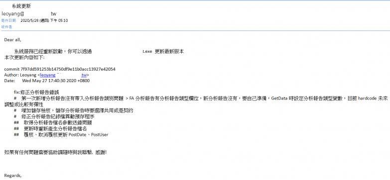
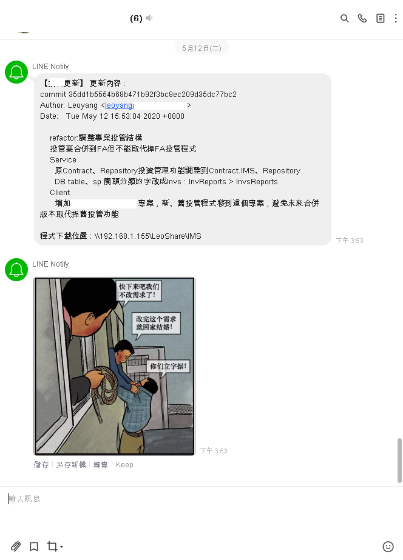

### 透過GitHook Prepush機制，Push時部屬程式
#### 環境準備
- Git
- Python
用Python主要是因為不用編譯，拿來做一些Script很方便

#### 準備githook - Prepush
git hook 機制可以讓我們在commit、pull、push….e.t.c.時執行特定的動作，例如執行測試、寄信通知更新、檢查編譯是否通過等…..hen方便

在開發的專案下，githook目錄中把pre-prepush.sample副檔名移除 > pre-push

*盡量用改的，因為githook裡面有一些特殊的編碼，如果自己寫可能會有問題

路徑 : Project\ProjectName.git\hooks\

在prepush中增加下面內容，也可以視情況移除掉不需要的指令或是更改路徑、命名

```batch
#!/bin/sh

# 取得最後一次commit內容到文字檔
git log -n 1 > "D:\NeverRemove.txt"

# 通知
## Notify通知重啟服務
python .git/hooks/LineNotifyReboot.py
## Mail通知重啟服務
python .git/hooks/MailNotifyReboot.py

# 停用服務
.git/hooks/StartOrStopService.exe

# 備份 && 發布
.git/hooks/backup.bat

# 啟用服務
.git/hooks/StartOrStop.exe

# 通知
## Notify通知更新完成
python .git/hooks/LineNotifyRelease.py
## Mail通知更新完成
python .git/hooks/MailNotifyRelease.py
```

#### 準備通知程式
##### MailNotifyReboot.py – 信件通知重啟程式
```python
# -*- coding: utf-8 -*-
import json
from email.mime.text import MIMEText
import smtplib


# Account infomation load
gmailUser = 'yourmail@gmail.com'
gmailPasswd = 'yourpassword'
to = ['receiver1@gmail.com', 'receiver2@gmail.com', 'receiverˇ@gmail.com']

# Create message
emails = [t.split(',') for t in to]
message = MIMEText('Dear all,\n\nOO系統服務將在幾分鐘內重新啟動，請盡快將正在操作的資料儲存避免資料遺失。\n如果有任何問題需要協助請隨時與我聯繫，感謝 !\n\nRegards,\n', 'plain', 'utf-8')
message['Subject'] = 'OO系統更新'
message['From'] = gmailUser
message['To'] = ','.join(to)

# Set smtp
smtp = smtplib.SMTP("mail.com.tw:25")
smtp.ehlo()
smtp.starttls()
smtp.login(gmailUser, gmailPasswd)

# Send msil
smtp.sendmail(message['From'], message['To'], message.as_string())
print('Send mails OK!')
```

##### LineNotifyReboot.py – LineNotify通知重啟程式
```python
import requests
import sys

def lineNotifyMessage(token, msg, url):
      headers = {
          "Authorization": "Bearer " + token, 
          "Content-Type" : "application/x-www-form-urlencoded"
      }
	
      payload = {'message': msg,  'imageThumbnail': url,'imageFullsize': url}
      r = requests.post("https://notify-api.line.me/api/notify", headers = headers, params = payload)
      return r.status_code
	

f = open("D:/NeverRemove.txt", "r",encoding="utf-8")
message = "Dear all,\n\nOOO system service will be rebooted in a few minutes, please save important data to avoid data loss.\nIf you have any questions, please feel free to contact me, thank you!\n\n128 Leo\n\nRegards,\n"

url = "https://e23882.github.io/img/maybe.PNG"
# 修改為你的權杖內容
token= 'yourlinenotifytoken'
#lineNotifyMessage(token, message, url)
```


#### 準備備份、發布批次檔
backup.bat :
```batch
:: 產生備份目錄
set Date_folder=%date:~0,4%%date:~5,2%%date:~8,2%_%time:~0,2%%time:~3,2%%time:~6,2%
:: 產生備份目錄
md "\\Server\備份\"%Date_folder%
:: 備份 client 64/32bits
xcopy "\\Server\Deploy" "\\Server\備份\"%Date_folder% /E /H /C /I /Y

:: 備份 service
xcopy "\\Server\ApServices" "\\Server\備份\"%Date_folder%"\Service" /E /H /C /I /Y

:: 更新Client檔案
xcopy "D:\Backup\Project\bin\Debug" "\\Server\JepunShare_IMS\JepunIMSDeploy\32" /E /H /C /I /Y /exclude:D:\Backup\Project\.git\hooks\Exclude.txt
xcopy "D:\Backup\Project\bin\Debug" "\\Server\JepunShare_IMS\JepunIMSDeploy\64" /E /H /C /I /Y /exclude:D:\Backup\Project\.git\hooks\Exclude.txt

:: 更新服務
xcopy "D:\Backup\Project\Service\bin\Debug" "\\Server\Services" /E /H /C /I /Y /exclude:D:\Backup\Project\.git\hooks\Exclude.txt
```
Exclude.txt – 不複製檔案清單
```
.pdb
.xml
App_Data
.txt
```

[完整程式碼](透過Git-Hook，push時部屬程式-pre-push/https://github.com/e23882/GitHook/tree/master/Depoly)