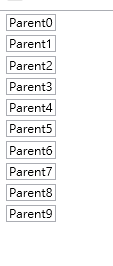

### DataTemplate
用資料(集合)產生元件
```xml
<!-- 定義使用資料集合中的什麼欄位，每個欄位要長怎樣 -->
<Window.Resources>
        <DataTemplate x:Key="template">
            <StackPanel>
                <TextBox Text="{Binding Name}"/>
            </StackPanel>
        </DataTemplate>
    </Window.Resources>
<Grid>
        <!-- 綁定資料來源(Itemsource)、指定資料要用什麼樣的範本長出來 -->
	<ListBox ItemTemplate="{StaticResource template}" ItemsSource="{Binding DataCollection}"/>
</Grid>
```
所以MainData如果有十筆資料，每筆資料中只要有Name欄位的就會長出一個TextBox Text屬性是Name的值

### ControlTemplate
定義元件的樣式
```xml
<!-- 定義Button的ControlTemplate -->
 <Window.Resources>
        <ControlTemplate TargetType="Button" x:Key="ButtonTemplate">
            <Border CornerRadius="10" Background="LightBlue" Height="100" Width="100">
                <TextBlock Text="123" TextAlignment="Center" VerticalAlignment="Center"/>
            </Border>
        </ControlTemplate>
</Window.Resources>

<StackPanel>
    <!-- Button使用定義好的ControlTemplate -->
    <Button Template="{StaticResource ButtonTemplate}"/>
</StackPanel>
```


### DataTemplate、ControlTemplate 差別
- DataTemplate : 定義資料長出怎樣的畫面
- ControlTemplate : 定義元件的樣式

### 常跟ControlTemplate一起用的

- Style  : 元件的樣式
- Setter : 設定元件的???
    ```xml
    <Style TargetType="Button" x:Key="ButtonCommon">
        <Setter Property="Background" Value="Red"/>
        <Setter Property="Content" Value="Default"/>
        <Setter Property="FontSize" Value="30"/>
    </Style>
    ```
- StoryBoard : 故事板，敘述屬性在多少時間內的變化
- Trigger    : 觸發器，定義觸發故事板的事件
    ```xml
     <Style TargetType="Button" x:Key="ButtonCommon">
        <Setter Property="Width" Value="100"/>
        <Setter Property="Height" Value="100"/>
        <Setter Property="Content" Value="Test"/>
            <Setter Property="Template">
            <Setter.Value>
                <ControlTemplate>
                    <Grid>
                        <Button Content="123"/>
                    </Grid>
                        <ControlTemplate.Triggers>
                        <Trigger Property="IsMouseOver" Value="True">
                            <Trigger.EnterActions>
                                <BeginStoryboard>
                                    <Storyboard>
                                        <DoubleAnimation Storyboard.TargetProperty="Width" To="110" Duration="0:0:0.15"/>
                                        <DoubleAnimation Storyboard.TargetProperty="Height" To="70" Duration="0:0:0.15"/>
                                    </Storyboard>
                                </BeginStoryboard>
                            </Trigger.EnterActions>
                        </Trigger>
                    </ControlTemplate.Triggers>
                </ControlTemplate>
            </Setter.Value>
        </Setter>
    </Style>
    ```
