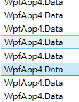
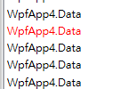

## DataTemplate被選取時樣式

### 1.設定ListBox被選取的樣式
```xml
 <Window.Resources>
     <Style x:Key="ListBoxItemStyle" TargetType="ListBoxItem">
         <Setter Property="Template">
             <Setter.Value>
                 <ControlTemplate TargetType="ListBoxItem">
                     <Border
                         Name="CurrentBorder"
                         Padding="2"
                         SnapsToDevicePixels="true">
                         <ContentPresenter />
                     </Border>
                     <ControlTemplate.Triggers>
                         <Trigger Property="IsSelected" Value="true">
                             <Setter TargetName="CurrentBorder" Property="Background" Value="Transparent" />
                             <Setter Property="Foreground" Value="Red" />
                         </Trigger>
                     </ControlTemplate.Triggers>
                 </ControlTemplate>
             </Setter.Value>
         </Setter>
     </Style>
 </Window.Resources>
```

### 2.套用
```xml
<ListBox ItemContainerStyle="{StaticResource ListBoxItemStyle}" ItemsSource="{Binding Data}" />
```

套用前: 被選取有比較深的藍色，滑鼠移動到的項目會有淡藍色



套用後: 被選取的項目沒有背景顏色、選到的字是紅色，滑鼠移動到的項目不會有背景顏色

