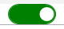
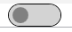

## ToggleButton的ToggleSwitch樣式

### 1.建立一個共用的ResourceDictionary
```xml
<Style x:Key="ToggleButtonStyle" TargetType="{x:Type ToggleButton}">
    <Setter Property="Tag" Value="{DynamicResource {x:Static SystemParameters.HighContrastKey}}" />
    <Setter Property="HorizontalContentAlignment" Value="Center" />
    <Setter Property="VerticalContentAlignment" Value="Center" />
    <Setter Property="Template">
        <Setter.Value>
            <ControlTemplate TargetType="{x:Type ToggleButton}">
                <ControlTemplate.Resources>
                    <Storyboard x:Key="OnChecked">
                        <ThicknessAnimationUsingKeyFrames Storyboard.TargetName="path" Storyboard.TargetProperty="(FrameworkElement.Margin)">
                            <EasingThicknessKeyFrame KeyTime="0" Value="1.5,0,0,0" />
                        </ThicknessAnimationUsingKeyFrames>
                        <DoubleAnimation
                            Storyboard.TargetName="translateTransform"
                            Storyboard.TargetProperty="X"
                            From="0"
                            To="40"
                            Duration="0:0:0.2" />
                    </Storyboard>
                    <Storyboard x:Key="OnUnchecked">
                        <ThicknessAnimationUsingKeyFrames Storyboard.TargetName="path" Storyboard.TargetProperty="(FrameworkElement.Margin)">
                            <EasingThicknessKeyFrame KeyTime="0" Value="0" />
                        </ThicknessAnimationUsingKeyFrames>
                        <DoubleAnimation
                            Storyboard.TargetName="translateTransform"
                            Storyboard.TargetProperty="X"
                            From="40"
                            To="0"
                            Duration="0:0:0.2" />
                    </Storyboard>
                </ControlTemplate.Resources>
                <Border
                    x:Name="toggleBorder"
                    Width="60"
                    Height="26"
                    Background="Green"
                    BorderBrush="Black"
                    BorderThickness="1"
                    CornerRadius="13">
                    <Grid>
                        <!--  Path with TranslateTransform to animate its position  -->
                        <Path x:Name="path">
                            <Path.RenderTransform>
                                <TranslateTransform x:Name="translateTransform" />
                            </Path.RenderTransform>
                            <Path.Fill>
                                <LinearGradientBrush StartPoint="1,0" EndPoint="1,1">
                                    <GradientStop Color="White" />
                                </LinearGradientBrush>
                            </Path.Fill>
                            <Path.Data>
                                <GeometryGroup>
                                    <GeometryGroup.Children>
                                        <EllipseGeometry
                                            Center="6,12"
                                            RadiusX="9"
                                            RadiusY="9" />
                                    </GeometryGroup.Children>
                                </GeometryGroup>
                            </Path.Data>
                        </Path>
                    </Grid>
                </Border>
                <ControlTemplate.Triggers>
                    <EventTrigger RoutedEvent="ToggleButton.Checked">
                        <BeginStoryboard Storyboard="{StaticResource OnChecked}" />
                    </EventTrigger>
                    <EventTrigger RoutedEvent="ToggleButton.Unchecked">
                        <BeginStoryboard Storyboard="{StaticResource OnUnchecked}" />
                    </EventTrigger>
                    <Trigger Property="IsChecked" Value="True">
                        <Setter Property="Background" Value="DimGray" />
                        <Setter TargetName="toggleBorder" Property="Background" Value="Green" />
                        <Setter TargetName="toggleBorder" Property="BorderBrush" Value="Green" />
                    </Trigger>
                    <Trigger Property="IsChecked" Value="False">
                        <Setter TargetName="toggleBorder" Property="Background" Value="LightGray" />
                        <Setter TargetName="path" Property="Fill">
                            <Setter.Value>
                                <LinearGradientBrush StartPoint="1,0" EndPoint="1,1">
                                    <GradientStop Color="Gray" />
                                </LinearGradientBrush>
                            </Setter.Value>
                        </Setter>
                        <Setter TargetName="path" Property="Data">
                            <Setter.Value>
                                <GeometryGroup>
                                    <GeometryGroup.Children>
                                        <EllipseGeometry
                                            Center="13,12"
                                            RadiusX="9"
                                            RadiusY="9" />
                                    </GeometryGroup.Children>
                                </GeometryGroup>
                            </Setter.Value>
                        </Setter>
                    </Trigger>
                    <Trigger Property="IsMouseOver" Value="true">
                        <Setter Property="Cursor" Value="Hand" />
                    </Trigger>
                </ControlTemplate.Triggers>
            </ControlTemplate>
        </Setter.Value>
    </Setter>
</Style>
```

### 2.在Xaml中宣告，讓整個專案都可以使用
```xml
<Application
    x:Class="WpfApp4.App"
    xmlns="http://schemas.microsoft.com/winfx/2006/xaml/presentation"
    xmlns:x="http://schemas.microsoft.com/winfx/2006/xaml"
    xmlns:local="clr-namespace:WpfApp4"
    StartupUri="MainWindow.xaml">
    <Application.Resources>
        <ResourceDictionary Source="/WpfApp4;Component/Component.xaml" />
    </Application.Resources>
</Application>
```
Source="/專案名稱;專案中的路徑/檔案名稱"
<ResourceDictionary Source="/WpfApp4;Component/Component.xaml" />

啟動

關閉
