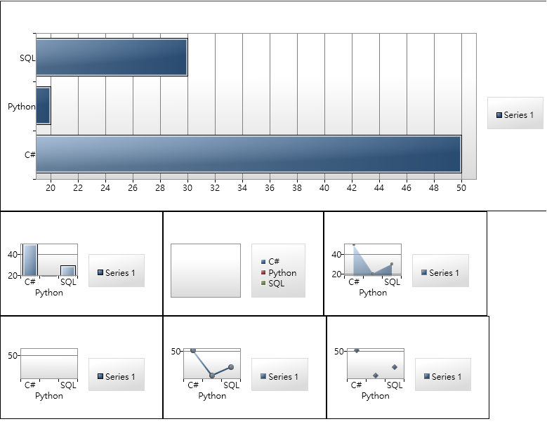

介紹兩個我常用的圖表元件

## Live Chart
[LiveChart介紹、SourceCode](WPF-Chart/https://lvcharts.net/)

### 安裝套件
nuget安裝LiveCharts.Wpf

### xaml引用資源、使用圖表
```xml
xmlns:lvc="clr-namespace:LiveCharts.Wpf;assembly=LiveCharts.Wpf"
```

### 範例
```
<Grid>
    <lvc:PieChart LegendLocation="Bottom" Hoverable="False" DataTooltip="{x:Null}">
        <lvc:PieChart.Series>
            <lvc:PieSeries Title="C#" Values="2" DataLabels="True" PushOut="8" />
            <lvc:PieSeries Title="Java" Values="4" DataLabels="True" />
            <lvc:PieSeries Title="Python" Values="6" DataLabels="True" />
            <lvc:PieSeries Title="SQL" Values="2" DataLabels="True" />
        </lvc:PieChart.Series>
    </lvc:PieChart>  
</Grid>
```
### 執行結果


### 優點
很漂亮，想的到的東西都會動

### 缺點
live chart在時限mvvm模式的時候比較不友善，而且專案也已經很久沒更新了(2018)。除此之外用的記憶體比較多，在做一些比較複雜的報表也不是說很方便，你只要看了他的sample code就會明白了....

---
## WPF ToolKit Chart (推薦)

### 安裝套件
nuget安裝
```csharp
System.Windows.Controls.DataVisualization.Toolkit
```
### 引用資源
```xml
xmlns:chartTool="clr-namespace:System.Windows.Controls.DataVisualization.Charting;assembly=System.Windows.Controls.DataVisualization.Toolkit"
```
### 範例
```xml
<WrapPanel>
    <chartTool:Chart Height="300" Width="800">
        <chartTool:BarSeries DependentValuePath="Value" IndependentValuePath="Key" ItemsSource="{Binding DataCollection}"/>
    </chartTool:Chart>
    <chartTool:Chart>
        <chartTool:ColumnSeries MinHeight="500" DependentValuePath="Value" IndependentValuePath="Key" ItemsSource="{Binding DataCollection}"/>
    </chartTool:Chart>
    <chartTool:Chart>
        <chartTool:PieSeries MinHeight="500" DependentValuePath="Value" IndependentValuePath="Key" ItemsSource="{Binding DataCollection}"/>
    </chartTool:Chart>
    <chartTool:Chart>
        <chartTool:AreaSeries MinHeight="500" DependentValuePath="Value" IndependentValuePath="Key" ItemsSource="{Binding DataCollection}"/>
    </chartTool:Chart>
    <chartTool:Chart>
        <chartTool:BubbleSeries MinHeight="500" DependentValuePath="Value" IndependentValuePath="Key" ItemsSource="{Binding DataCollection}"/>
    </chartTool:Chart>
    <chartTool:Chart>
        <chartTool:LineSeries MinHeight="500" DependentValuePath="Value" IndependentValuePath="Key" ItemsSource="{Binding DataCollection}"/>
    </chartTool:Chart>
    <chartTool:Chart>
        <chartTool:ScatterSeries MinHeight="500" DependentValuePath="Value" IndependentValuePath="Key" ItemsSource="{Binding DataCollection}"/>
    </chartTool:Chart>
</WrapPanel>
```
```csharp
public class BarChartViewModel:ViewModelBase
{
    private List<DataModel> _DataCollection = new List<DataModel>();

    public BarChartViewModel()
    {
        DataCollection.Add(new DataModel(){ Key = "C#", Value = 50});
        DataCollection.Add(new DataModel(){ Key = "Python", Value = 20});
        DataCollection.Add(new DataModel(){ Key = "SQL", Value = 30});
    }

    public List<DataModel> DataCollection
    {
        get
        {
            return _DataCollection;
        }
        set
        {
            _DataCollection = value;
            OnPropertyChanged();
        }
    }

}

public class DataModel
{
    public string Key { get; set; }
    public int Value { get; set; }
}
```

### 執行結果


### 優點
雖然沒有像live chart一樣有那麼多動畫，但是可以很輕鬆滿足MVVM的設計，使用資源也很少很好用，你只要在xaml中定義chart位置，把元件的itemsource屬性綁定到ViewModel中，剩下就只要專注在設計ViewModel就可以了

### 缺點
比較醜

## SampleCode
[SampleCode](WPF-Chart/https://github.com/e23882/WPFChartSample)