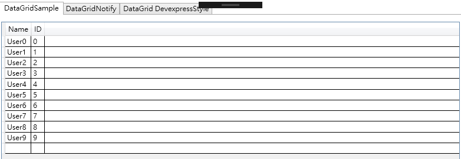
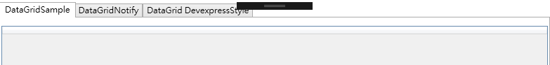
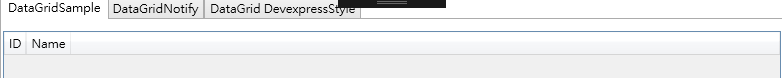
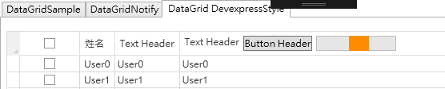

# 簡單DataGrid範例
## 畫面

## 程式(MVVM)
### 1. DataModel.cs
```csharp
namespace DataGridDemo
{
    //定義ViewModel中資料集合每筆資料有哪些欄位
    class DataModel
    {
        public string Name { get; set; }
        public int ID { get; set; }
    }
}

```
### 2. ViewModel.cs

    Q 為啥要用ObservableCollection<T>不用List<T>或是IEnumerable<T>就好
    A 因為ObservableCollection在有新的資料加入集合的時候，畫面會自動更新，如果用List、IEnumerable，新的資料加入集合，畫面上是不會顯示這筆資料的，要額外去處理新資料加入時的邏輯，但是ObservableCollection會比較慢，所以要看情況用
    

```csharp
using System.Collections.ObjectModel;

namespace DataGridDemo
{
    //定義給畫面用的ViewModel有哪些屬性
    class ViewModel
    {
        private ObservableCollection<DataModel> _DataCollection = new ObservableCollection<DataModel>();

        //用ObservableCollection，集合中資料異動時，畫面會自動更新很方便
        public ObservableCollection<DataModel> DataCollection
        {
            get
            {
                return _DataCollection;
            }
        }

        public ViewModel()
        {
            for (int i = 0; i < 10; i++)
            {
                DataCollection.Add(new DataModel()
                {
                    ID = i,
                    Name = "User" + i
                });
            }
        }
    }
}

```

### 3. MainWindow.xaml
```xml
<Window x:Class="DataGridDemo.MainWindow"
        xmlns="http://schemas.microsoft.com/winfx/2006/xaml/presentation"
        xmlns:x="http://schemas.microsoft.com/winfx/2006/xaml"
        xmlns:d="http://schemas.microsoft.com/expression/blend/2008"
        xmlns:mc="http://schemas.openxmlformats.org/markup-compatibility/2006"
        xmlns:local="clr-namespace:DataGridDemo"
        mc:Ignorable="d"
        Title="MainWindow" Height="450" Width="800">
    <Grid>
        <Grid.RowDefinitions>
            <RowDefinition Height="10"/>
            <RowDefinition Height="100"/>
            <RowDefinition Height="10"/>
        </Grid.RowDefinitions>
        <DataGrid ItemsSource="{Binding DataCollection}" Grid.Row="1"/>
    </Grid>
</Window>
```
### 4. MainWindow.xaml.cs
```csharp
using System.Windows;

namespace DataGridDemo
{
    /// <summary>
    /// MainWindow.xaml 的互動邏輯
    /// </summary>
    public partial class MainWindow : Window
    {
        public MainWindow()
        {
            InitializeComponent();
            //產生ViewModel實例
            ViewModel main = new ViewModel();
            //設定xaml的ViewModel來源為ViewModel的實例 main
            this.DataContext = main;
        }
    }
}
```
***

# DataGrid 常見問題
## 沒有資料的時候顯示預設的DataGrid Header
### Q DataGrid沒有資料的時候沒有顯示預設的欄位名稱
不要長這樣<br>


### A 解決方法
在DataGrid中先定義好有哪些欄位
```xml
<!-- 在DataGrid中定義有哪些欄位 -->
 <DataGrid ItemsSource="{Binding DataCollection, UpdateSourceTrigger=PropertyChanged}" Grid.Row="1" AutoGenerateColumns="False" >
    <DataGrid.Columns>
        <DataGridTextColumn Header="ID"    Binding="{Binding ID}"/>
        <DataGridTextColumn Header="Name"  Binding="{Binding Name}"/>
    </DataGrid.Columns>
</DataGrid>
```
這樣就算沒有資料還是會顯示欄位


***

## 自訂DataGrid Header樣式
### Q DataGrid Header不想要只有單純的文字，想要顯示CheckBox讓User可以全選

### A 解決方法 － DataGridTemplateColumn

透過HeaderTemplate、CellTemplate可以設定DataGrid要長什麼樣子
```xml
   <DataGrid x:Name="dgData" ItemsSource="{Binding DataCollection, UpdateSourceTrigger=PropertyChanged, Mode=TwoWay}" >
    <DataGrid.Resources>
        <SolidColorBrush x:Key="{x:Static SystemColors.HighlightBrushKey}" Color="LightGray"/>
    </DataGrid.Resources>
    <DataGrid.Columns>
        <!--DataGridTextColumn-->
        <DataGridTextColumn Header="姓名" Binding="{Binding Name}" />
        <!--DataGridTemplateColumn 可以定義Header、Cell要如何呈現資料-->
        <DataGridTemplateColumn>
            <DataGridTemplateColumn.HeaderTemplate>
                <DataTemplate>
                    <TextBlock Text="Text Header"/>
                </DataTemplate>
            </DataGridTemplateColumn.HeaderTemplate>
            <DataGridTemplateColumn.CellTemplate>
                <DataTemplate>
                    <TextBlock Text="{Binding Name}"/>
                </DataTemplate>
            </DataGridTemplateColumn.CellTemplate>
        </DataGridTemplateColumn>
        <!--Sample-->
        <DataGridTemplateColumn>
            <DataGridTemplateColumn.HeaderTemplate>
                <DataTemplate>
                    <StackPanel Orientation="Horizontal">
                        <TextBlock Text="Text Header"/>
                        <Button Content="Button Header" Margin="5,0,0,0"/>
                        <ProgressBar  Foreground="DarkOrange"  Minimum="0" Maximum="100" IsIndeterminate="True" Width="100" Margin="5,0,0,0"/>
                    </StackPanel>
                </DataTemplate>
            </DataGridTemplateColumn.HeaderTemplate>
            <DataGridTemplateColumn.CellTemplate>
                <DataTemplate>
                    <TextBlock Text="{Binding Name}"/>
                </DataTemplate>
            </DataGridTemplateColumn.CellTemplate>
        </DataGridTemplateColumn>
    </DataGrid.Columns>
</DataGrid>
```
***
[SampleCode](WPF-DataGrid/https://github.com/e23882/DataGridSample)
