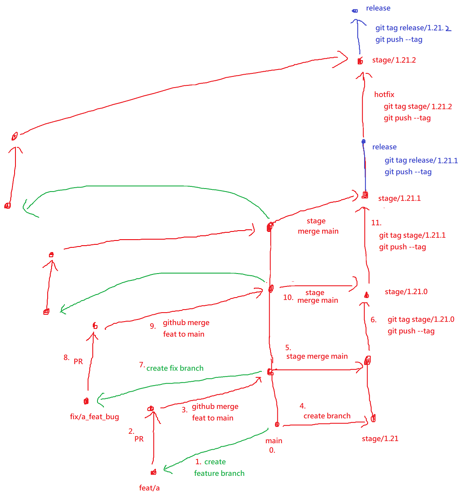

# 基本指令
### init － 建立版本庫
```git
git init
```
***
### add － 加入目前資料夾所有檔案到git
```git
git add .
```
***
### commit － 提交
```git
git commit -m "commit message"
```
***
### remote － 設定git remote位置(git server)

設定
```git
git remote add origin https://github.com/e23882/test.git
```

查詢
```git
git remote -v
```

刪除
```git
git remote remove RemoteName
```
同一個RemoteName可以設定多個GitRemote位置(一次push三個位置)
```git
git remote set-url RemoteName --push --add \\123.1.1.1\GitLocation1
git remote set-url RemoteName --push --add \\123.1.1.1\GitLocation2
git remote set-url RemoteName --push --add \\123.1.1.1\GitLocation3
```
***
### Pull

指令 : git pull GitRemoteURL BranchName
```git
git pull original master
```
***
### Push － 推送

指令 : git push -u <RemoteName> <BranchName>
```git
git push -u original master
```
git amend後以最新的版本蓋掉舊的commit
```git
git push -f 
```
***

### stash
將目前異動的檔案存入暫存

### Log － 查看紀錄

看所有本地git紀錄
```git
git log 
```

看指定數量本地git紀錄
指令 : git log -n <數量>
```git
git log -n 2
```

輸出log
指令 : git log -n 1 > [AbsolutePath]

```git
git log -n 1 > "D:\NeverRemove.txt"
```

一行顯示commit log 
```git
git log --oneline
```
***
### checkout － 切換branch

切換分支(Branch)
指令: git checkout [BranchName]
```git
git checkout LeoDerBranch
```

建立並切換分支 : git checkout -b [BranchName]
```git
git checkout -b LeoDerBranch    
```
***
### branch － 建立分支
指令 : 
git branch <BranchName>

```git
git branch LeoDerBranch
```
***
### rm － 移除版控上檔案
```git
git rm -r -n --cached ./folder
git rm -r --cached ./folder
```
***
### reset － 復原
#### - hard
會把目前專案目錄都復原到某個版本
本地git回復到最新版本(目前本地最新的)
```git
git reset --hard HEAD
```
本地git復原到git remote最新版本
```git
git pull GitRemoteURL
```

本地git回復到上一個版本(原本的那個版本就不見了)
```git
git reset --hard HEAD~
```
回復到前n個版本(n之後的版本都不見了)
```git
git reset --hard HEAD~n
```

#### - soft
跟hard一樣，但是本地專案的檔案不會跟著復原，只有版控有變更而已
***
***

# 常用組合用法
### 顯示出某日區間所有異動檔案清單(會重複)
```git
git log --no-merges --pretty=format:\"%an_%ae|%s|%ad\" --name-only --since='2020/3/1' --until '2020/3/30' -- *.cs *.sql *.xaml > logs.txt
```
# git flow


### 建立專案第一次初始化git、commit、push
```git
初始化
git add . 
看那些檔案加入commit
git status
復原加入commit的檔案
git reset HEAD FileName
git reset HEAD FolderName
提交
git commit -m "commit message"
設定GitRemote位置
git remote add original gitServerLocation
Push
git push -u original master
```

### 狀況:修改程式後commit > pull，pull時發現git remote已經發生異動
```git
git add .
git commit -m "update content"
git pull
發生 : 
    CONFLICT (content): Merge conflict in xxx.xx
    Automatic merge failed; fix conflicts and then commit the result.

解決方法:
取消git自動merge的動作, 這時候檔案會變成異動完,但是還沒merge,所以不會有衝突,要先解決衝突
git reset --merge

解決衝突(把有衝突的檔案移動到上一層,避免新改的code被復原成舊的版本)
move file.txt ..
git reset --hard HEAD~
git pull
這時候就沒有衝突了,可以在把移動到上一層的檔案人工合併到目前版控中的檔案
然後再push
git add .
git commit -m "commit content"
git push origin master

```
